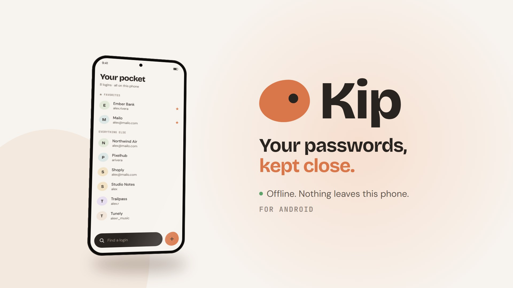

<p align="center">
  
</p>

# Kip

Kip is an offline password manager for Android. Your logins live in an encrypted database on your phone and nowhere else. There's no account, no cloud, and no sync. Release builds don't even have internet permission, so Android itself keeps Kip offline.

## What it does

**Keep your logins**
- Each login holds a name, username, password, site or app, notes, and custom fields. Favorites stay at the top.
- Search everything from the vault screen.
- A password generator lets you choose length, uppercase, numbers and symbols, and shows a strength meter.
- Copied passwords clear themselves from the clipboard after 15, 30 or 60 seconds.

**Fill and save in other apps**
- Kip is an Android **autofill service**. It offers your login right in the login field of apps and browsers, and you unlock it with your fingerprint first.
- When you sign in somewhere new, Android asks **"Save to Kip?"**. This works even while Kip is locked: the login waits in a sealed queue for you to review on your next unlock.
- You can link a login to an installed app so it fills there too.

**Add logins fast**
- **Shake** your phone to open Add. The sensitivity is Gentle or Firm.
- **Shake while Kip is closed** (opt-in). It listens only while the phone is unlocked, and a small notification shows while it's on.
- A **Quick Settings tile** and **app icon shortcuts** (Add login, Search) work without opening Kip first.

**Back up and move phones**
- An encrypted backup file (`.kip`) that only your master password opens. Save it wherever you like and restore it on a new phone.
- Import from a **Google Password Manager CSV**. Logins already in Kip are skipped, so importing twice is safe.

## Security

| | |
| --- | --- |
| Vault | SQLite with SQLCipher, keyed by a random 256-bit data key |
| Master password | Argon2id (64 MiB, 3 passes) wraps the data key. **It can't be reset or recovered.** |
| Fingerprint unlock | A copy of the data key behind an Android Keystore key that needs biometrics to use |
| Auto-lock | Locks when you leave the app, right away or after 1 or 5 minutes |
| Backups | The data key wrapped by your master password, plus every login sealed with AES-256-GCM |
| Autofill data | Sealed with Keystore RSA keys; the fill copy needs a fingerprint or screen lock for every use |
| Screen | `FLAG_SECURE`: no screenshots, and blank in recents |
| Network | No `INTERNET` permission in release builds |

## Build and run

Kip uses native Android code (autofill service, Quick Settings tile, Argon2id, the shake service), so it needs a **development build**. Expo Go won't work.

```bash
npm install
npx expo run:android     # build, install and start on a connected phone or emulator
```

After the first build, `npx expo start` is enough for JavaScript-only changes.

Cloud builds go through EAS: `npx eas-cli@latest build --profile development|preview|production`.

Before committing, run:

```bash
npx expo lint
npx tsc --noEmit
node --experimental-strip-types src/lib/password.check.ts
node --experimental-strip-types src/lib/import-csv.check.ts
```

## Project layout

```
src/app/              Screens (Expo Router): vault, add/edit, unlock, setup, settings
src/components/       Shared UI, dialogs, toasts, help topics
src/lib/              Vault, keys and crypto, backup, CSV import, shake, deep links
modules/kip-autofill/ Kotlin: autofill service, Quick Settings tile, shake service
modules/kip-crypto/   Kotlin: Argon2id
plugins/              Config plugins: icon shortcuts, no-internet release manifest
promo/                Remotion promo video (this README's banner is a frame from it)
```

`android/` is generated by `expo prebuild`. Don't edit it by hand; change `app.json`, the config plugins, or the modules instead.

## Limits

- **Android only.** iOS would need a credential provider extension, and iOS doesn't allow listening for shakes while an app is closed.
- **Nothing syncs.** Backups are your spare key, so make one before you change phones.
- **Some apps block autofill.** Manual add is always there.

## License

[MIT](LICENSE)
